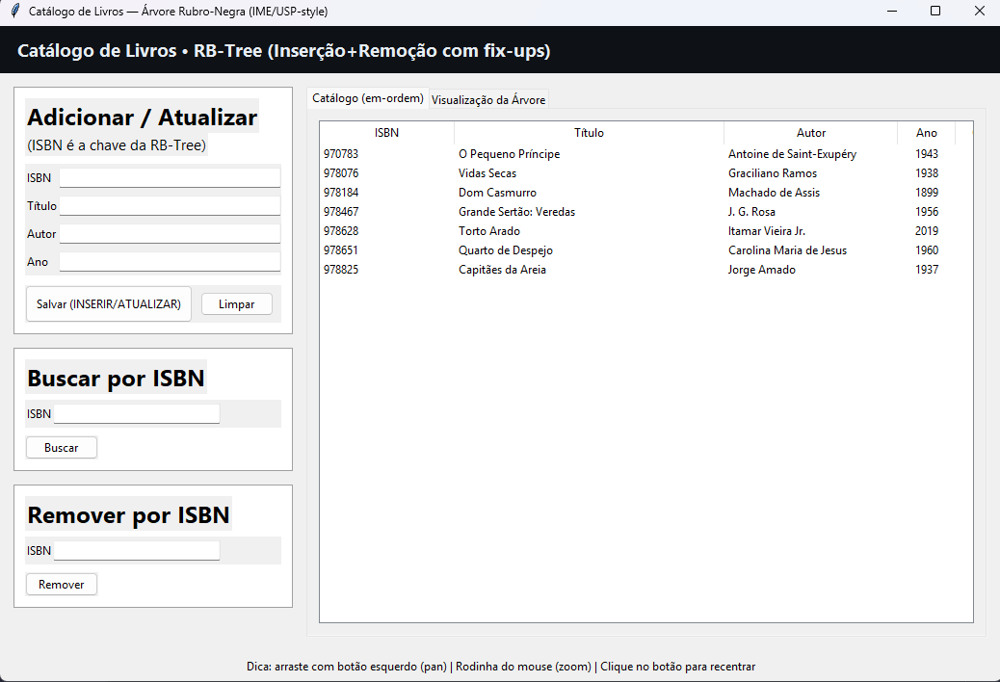
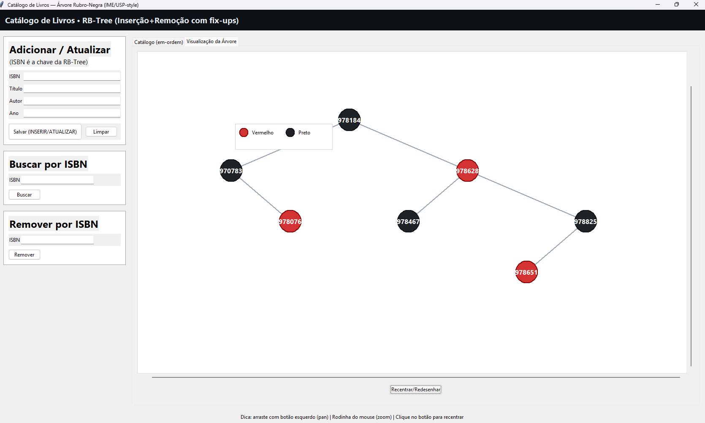

# Árvore rubro-negra - Buscador de livros

## Alunas
| Matrícula | Nome |
|-----------------------|---------------------|
| 20/0025058 | Mayara Alves de Oliveira |
| 20/2016720 | Luana Ribeiro Soares |

## Descrição do projeto

Este projeto tem como objetivo apresentar uma aplicação em Python que gerencia um acervo de livros usando uma árvore rubro-negra (Red-Black Tree).
A interface gráfica foi implementada com Tkinter e permite adicionar, buscar livros por ISBN e visualizar a estrutura da árvore.

Funcionalidades principais:
- Inserir livros com chave (ISBN) e metadados (título, autor, ano).
- Buscar livro por ISBN.
- Visualização gráfica da árvore (com suporte a zoom e arrastar).


## Guia de instalação

### Requisitos

- Python 3.8+ (testado em Python 3.11/3.13).
- Tkinter (normalmente incluído na instalação do Python no Windows). Se faltando, instale o pacote adequado ao seu sistema.

### Instalação das dependências

Este projeto usa apenas a biblioteca padrão do Python (Tkinter). Não há dependências via pip.

Recomenda-se criar um ambiente virtual (opcional, mas recomendado):

PowerShell (Windows):

```powershell
python -m venv .venv
.\.venv\Scripts\Activate.ps1
```

Depois de ativar o venv, não é necessário instalar pacotes adicionais.

### Executando a aplicação

No PowerShell, a partir da raiz do repositório:

```powershell
# (opcional) ativar venv
.\.venv\Scripts\Activate.ps1

# executar
python main.py
```

Ao abrir a aplicação, alguns pontos a testar:
- Botão "Adicionar Livro": abre um formulário para inserir ISBN, título, autor e ano.
- Botão "Buscar Livro": busca por ISBN e exibe os metadados, se existir.
- Botão "Mostrar Árvore": abre a visualização gráfica da árvore. Use a roda do mouse para dar zoom, arraste com o botão esquerdo para mover, e duplo-clique para resetar a visualização.

### Dicas e solução de problemas

- Erro "No module named 'tkinter'": instale o pacote do Tkinter para sua plataforma.
	- Windows: reinstale o instalador oficial do Python (marque a opção Tcl/Tk) ou use o instalador do Windows que inclui Tk.
	- Linux (Debian/Ubuntu):

```bash
sudo apt-get install python3-tk
```

## Capturas de tela

- **Home**  
    

- **Visualização da Árvore**  
    


## Gravação 
<br>

[](https://www.youtube.com/watch?v=SvSuG8IaGgk)

<br>


## Referências

- Material sobre Árvores Rubro-Negras (conteúdos didáticos).


